# LDtKプロジェクトを作成する

このセクションでは、タイルベースのゲームに適したシンプルなLDtKプロジェクトを作成します。

このプロジェクトには、壁のIntGridレイヤー、PlayerとGoalのエンティティを配置するEntityレイヤーがあります。

また、IntGridレイヤーの上に、壁と背景のビジュアルを定義するAutoTileルールがあります。

## 空のプロジェクトを作成

LDtKアプリを開き、新しいプロジェクトを作成します。このチュートリアルではプロジェクト名を`tile-based-game.ldtk`とし、Bevyプロジェクトの`assets`ディレクトリに保存します。

## ワールドレイアウトの設定

Worldタブで、WorldレイアウトをHorizontalに設定します。これによりエディター上でレベルは地理的な関係ではなく、明確な直線的な関係になります。

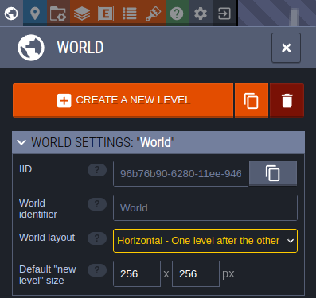

## タイルセットをインポート

Tilesetsタブで、環境／プレイヤーのタイルセットをプロジェクトに追加します。
これらのタイルセットのソース画像ファイルもBevyプロジェクトの`assets`ディレクトリに保存します。

タイルセットの名前をそれぞれ、`Environment, Player`にします。

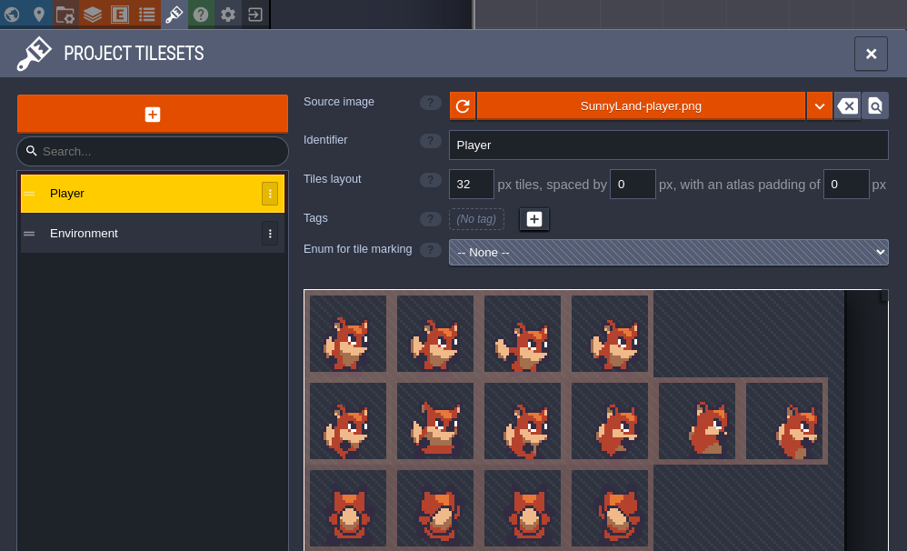

## 壁にIntGridレイヤーを追加

レイヤータブで、プロジェクトにIntGridレイヤーを追加します。
このレイヤーは、レベル内の衝突箇所を定義するために使用されます。

このレイヤーを`Walls`にします。

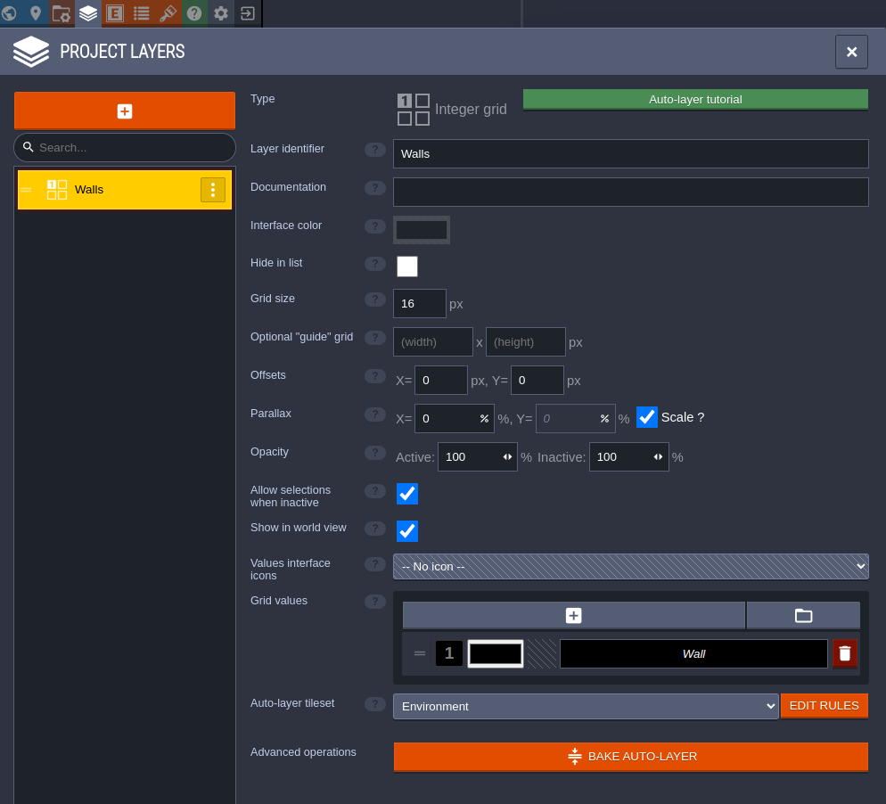

## 壁と背景のオートタイリングを定義

ウォールレイヤー定義から、Auto-layerタイルセットのEDIT RULESを選択します。
ここで、LDtKがレベルのIntGrid値に基づいて、レベルのウォールレイヤーを動的にレンダリングする方法を定義します。

最初に他のルールがマッチしない場合に背景タイルを配置するキャッチオールルールを定義します。

1. GROUPを選択して、新しい空のルールグループを追加し、Backgroundと名付ける。
2. 新しいグループで`+`を選択し、最初のルールを定義する。
3. ルール定義の右上`-`を選択し、背景として使用したいタイルを選択します。
4. これはキャッチオールルールなので、ルールパターンの変更は必要ありません。

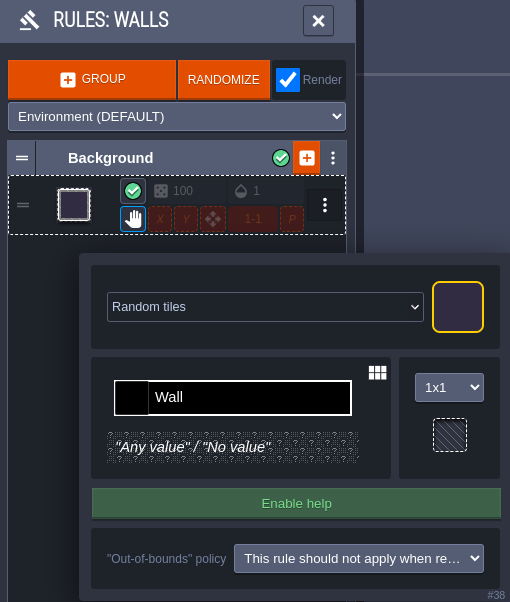

次にどのような壁のタイルでもキャッチするルールを定義します。
このルールの上にさらにルールを定義することでいろいろなことができますが、今回はやりません。

1. Wallsという名前の新しいグループを作成する。
2. Wallsグループの`+`をクリックして最初のルールを作成する。
3. 右上の一般的な壁タイルとして使いたいタイルを選択する。
4. ルールを`1x1`に設定し、ルールパターンを左クリックして壁タイルを配置する。

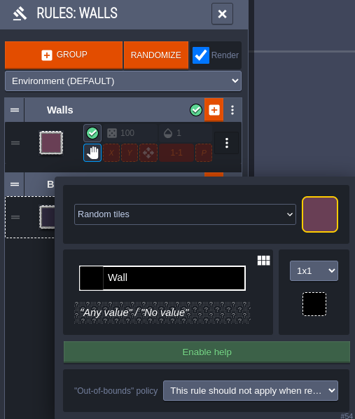

これでレベル内に壁を配置できるようになり、このタイルを使って自動的にレンダリングを行います。

次はオプションで壁のエッジ（水平エッジ）に使用するタイルを定義します。

1. Wallsグループに新しいルールを作成する。
2. 壁の左端として使用したいタイルを選択する。
3. `3x3`のパターンを使い、中央に壁タイルを置き、左にマイナスの壁タイルを置きます。これにより壁タイルがないタイルは全てマッチするようになります。
4. グループ内にこの新しいルールで`X`オプションを有効にします。これで`X`方向にルールが反映され、壁の右端にも機能するようになります。

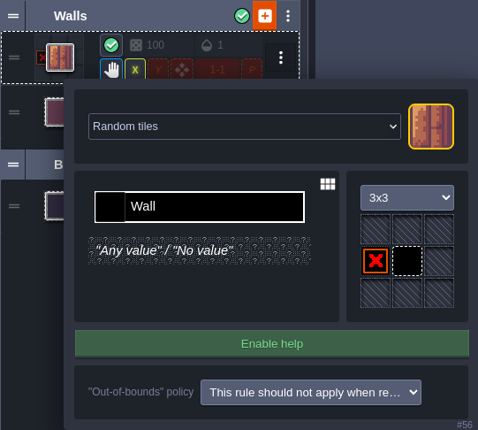

Wallsグループに、垂直のエッジやコーナーを定義するための、より複雑なパターンを持つルールの追加は自由です。
このチュートリアルでは詳しく触れませんがいかにその定義を示します。

一般的な推奨事項の1つは、ルールマッチャーがキャッチオールルールに最後に頼るように、これらのルールを特定的なもの順に特定的でないものへと並べることです。

垂直の壁エッジルール、 `Y`方向にミラーリング

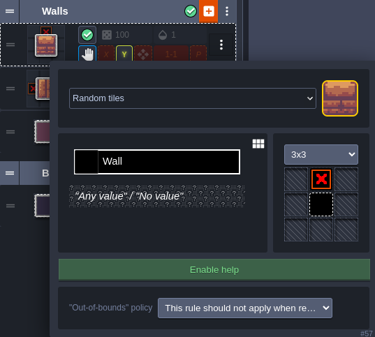

外角の壁のルール、`X, Y`方向にミラーリング

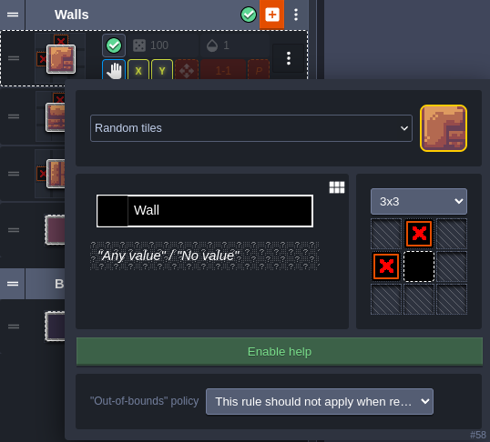

内角の壁のルール、`X, Y`方向にミラーリング

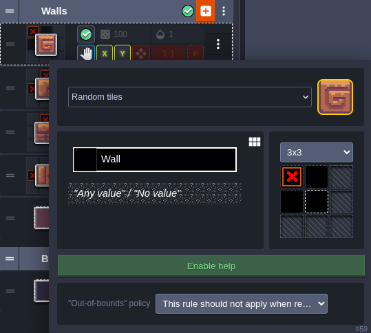

## エンティティレイヤーの追加

LayersタブでEntityレイヤーをプロジェクトに追加します。
これはプレイヤーやゴールなど、あまり傾かないゲームオブジェクトを配置するために使用します。

ここではデフォルトのエンティティレイヤーを変更しない形で行きます。

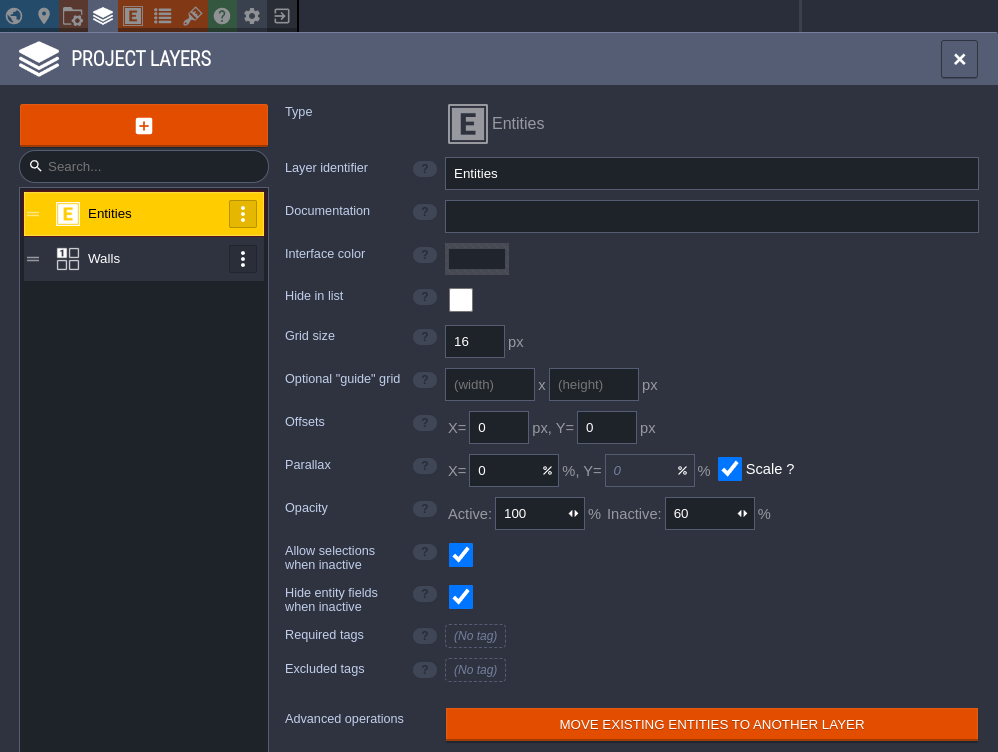

次にEntityタブでPlayerエンティティを追加します。
そしてエディタビジュアルにPlayerという名前をつけ、Playerタイルセットのタイルを使用するように設定します。

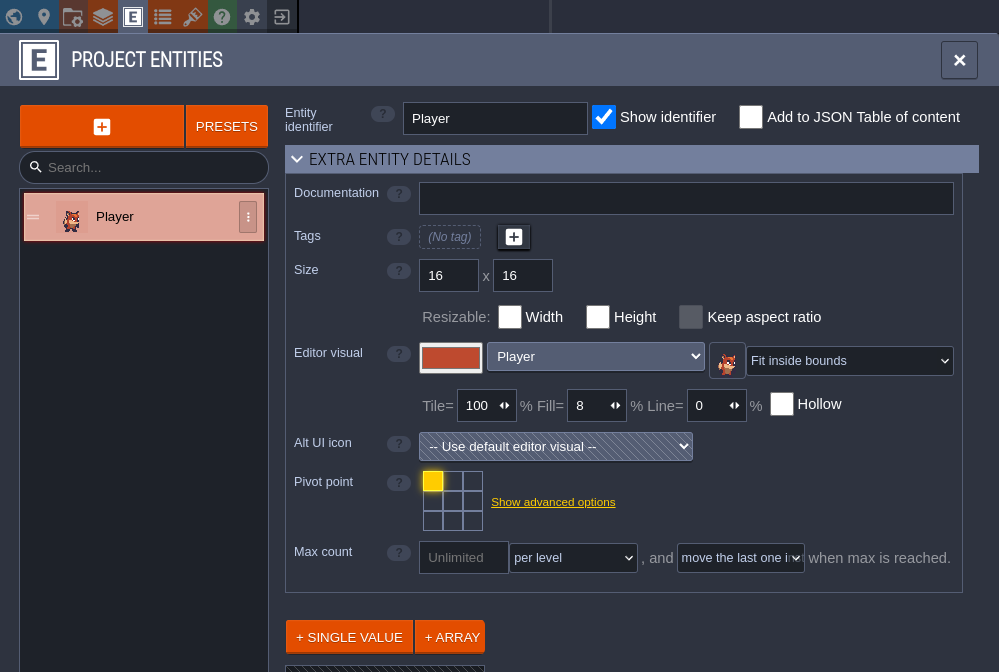

最後にGoalエンティティを追加します。
そしてエディタビジュアルにGoalという名前をつけ、タイルセットを設定します。

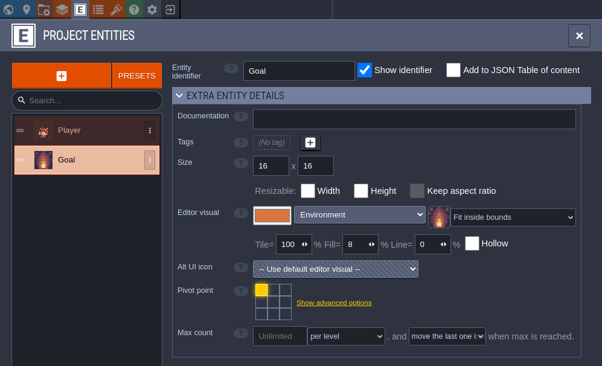

## レベルをデザイン

次の章では、このプロジェクトをBevyで起動し、ゲームプレイコードを実装します。
ゲームは単純なもので、プレイヤーをグリッドの中を移動させ、壁をナビゲートし、ゴールに到達したら次のレベルを開始します。

このことを念頭に置いて、これまでに設定したツールを使用して、いくつかのレベルをデザインしていきます。

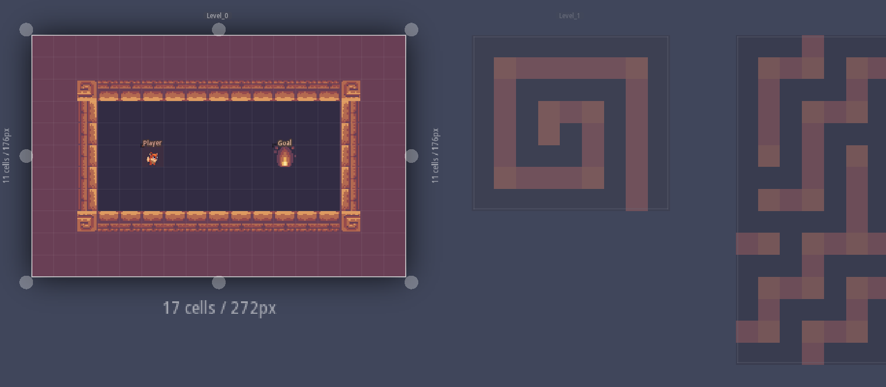

## 参考URL

https://trouv.github.io/bevy_ecs_ldtk/v0.9.0/tutorials/tile-based-game/create-your-ldtk-project.html
