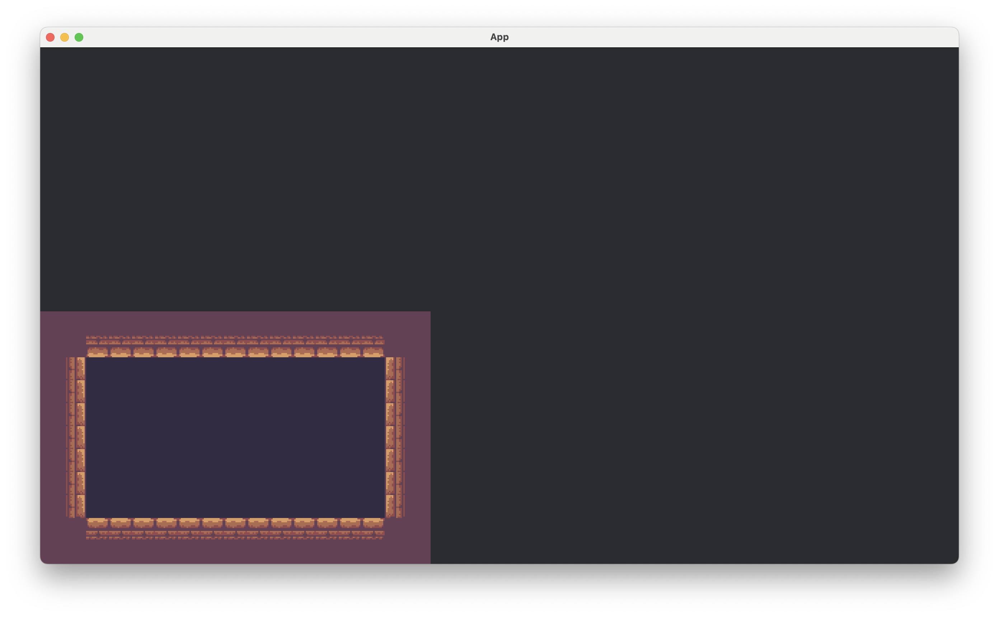
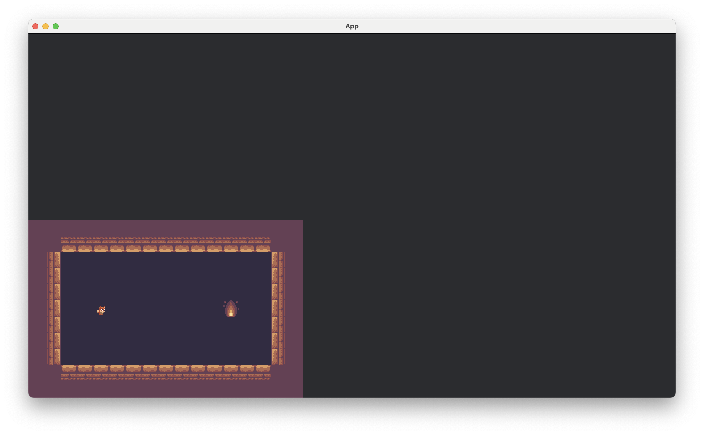

# BevyでLDtkを起動する

このセクションでは、LDtkエンティティのスプライトのスポーンも含めて、BevyでLDtkプロジェクトをロード・スポーンします。

このチュートリアルでは、前のセクションで作成したLDtkプロジェクトを使用します。

## 最小限のBevyをセットアップ

ゲームのメイン関数で、`DefaultPlugins, LdtkPlugin`を使用して、Bevyアプリを作成します。

```rust
use bevy::prelude::*;
use bevy_ecs_ldtk::prelude::*;

fn main() {
    App::new()
        .add_plugins(DefaultPlugins.set(ImagePlugin::default_nearest()))
        .add_plugins(LdtkPlugin)
        .add_systems(Update, bevy::window::close_on_esc)
        .run()
}
```

## 起動時にカメラと`LdtkWorldBundle`をスポーンする

カメラエンティティと`LdtkWorldBundle`エンティティを生成する起動システムを作成します。

後者は`Handle<LdtkProject>`が必要で、これはBevyの`AssetServer`リソースからLDtkプロジェクトをロードすることで取得できます。

このコードスニペットではカメラのスケールを2倍にし、トランスフォームを調整して、レベルを`720p`で表示しやすくしています。

```rust
fn main() {
    App::new()
        // ...
        .add_systems(Startup, setup)
        .add_systems(Update, bevy::window::close_on_esc)
        .run()
}

fn setup(mut commands: Commands, asset_server: Res<AssetServer>) {
    let mut camera = Camera2dBundle::default();

    camera.projection.scale = 0.5;
    camera.transform.translation.x += 1280.0 / 4.0;
    camera.transform.translation.y += 720.0 / 4.0;
    commands.spawn(camera);

    commands.spawn(LdtkWorldBundle {
        ldtk_handle: asset_server.load("tile-based-game.ldtk"),
        ..Default::default()
    });
}
```

最後に、`LevelSelection`リソースを挿入して、プラグインに最初のレベルを生成するように指示します。

最初のレベル（0インデックス）を選択するために、`index`メソッドを使用して`LevelSelection`を構築します。

```rust
fn main() {
    App::new()
        // ...
        .insert_resource(LevelSelection::index(0))
        // ...
        .run()
}
```

では`cargo run`を実行して、どのようになるのか見てみましょう！



## LDtkエンティティのスプライトを生成

今のままでは`Player, Goal`がまだレンダリングされていません。これらを表示するにはもう少しコードを追加する必要があります。

`PlayerBundle, GoalBundle`を作成し、それぞれ`SpriteSheetBundle`フィールドを持たせます。
これらのバンドルは次章で説明します。

これらのバンドルに対して`LdtkEntity`を導入し、フィールドに`#[sprite_sheet_bundle]`属性を与えます。
この`trait`の実装は、これらのバンドルがプラグインによってどのように生成されるかを定義します。

具体的には、エンティティのエディタビジュアルと同じスプライトとして生成されます。

```rust
#[derive(Default, Bundle, LdtkEntity)]
struct PlayerBundle {
    #[sprite_sheet_bundle]
    sprite_sheet_bundle: SpriteSheetBundle,
}

#[derive(Default, Bundle, LdtkEntity)]
struct GoalBundle {
    #[sprite_sheet_bundle]
    sprite_sheet_bundle: SpriteSheetBundle,
}
```

最後に、これらのバンドルを`register_ldtk_entity`を使ってアプリに登録し、LDtk識別子を与えます。
プラグインがこれらの識別子を持つエンティティを生成するとき、登録されたバンドルを使用します。

```rust
fn main() {
    App::new()
        // ...
        .register_ldtk_entity::<PlayerBundle>("Player")
        .register_ldtk_entity::<GoalBundle>("Goal")
        // ...
        .run()
}
```

これでスプライトが表示されます。



## 参考URL

https://trouv.github.io/bevy_ecs_ldtk/v0.9.0/tutorials/tile-based-game/spawn-your-ldtk-project-in-bevy.html
